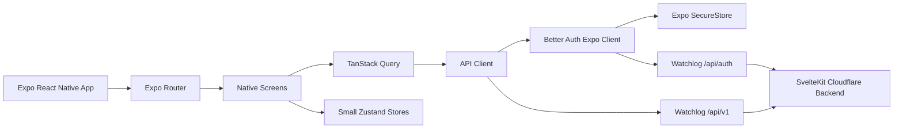

# Project Overview

Watchlog Mobile is a native Expo React Native app for iOS and Android that
connects to the existing Watchlog SvelteKit backend. It must implement the current
web app feature set with native mobile UX, Better Auth Expo authentication, and the
versioned `/api/v1` app API without introducing a separate backend or new product
scope.

## Repository Structure

- `app/` - Expo Router screens, stacks, tabs, modals, and deep-link routes.
- `src/components/` - Shared native UI primitives and feature components.
- `src/features/` - Feature modules for auth, content, watchlist, reviews, lists,
  profiles, notifications, feed, and settings.
- `src/lib/` - API client, auth client, query client, query keys, theme helpers.
- `src/stores/` - Small Zustand stores for UI state only.
- `src/types/` - Shared TypeScript API and domain types.
- `plugins/` - Expo config plugins that patch generated native projects.
- `assets/` - App icons, splash images, and local static assets.
- `SPEC.md` - Product scope, API contract, and acceptance criteria.
- `DESIGN.md` - Native design system, UX rules, and screen behavior.
- `README.md` - Human-facing setup and release documentation.
- `AGENTS.md` - Agent-facing rules and guardrails.
- `.env.example` - Safe public mobile environment template.
- `.gitignore` - Local env, dependency, native build, and generated-file ignores.
- `eas.json` - EAS Build profiles for development, preview, production, and submit.

## Build & Development Commands

Install dependencies:

```sh
npm install
```

Start development server:

```sh
npx expo start --dev-client
```

Run on iOS:

```sh
npx expo run:ios
```

Run on Android:

```sh
npx expo run:android
```

Run Expo diagnostics:

```sh
npx expo-doctor
```

Type-check:

```sh
npm run typecheck
```

Lint:

```sh
npm run lint
```

Test:

```sh
npm run test
```

Create preview builds:

```sh
eas build --platform all --profile preview
```

Create production builds:

```sh
eas build --platform all --profile production
```

Submit production builds:

```sh
eas submit --platform all
```

## Code Style & Conventions

- Use TypeScript strict mode.
- Use Expo Router file conventions for screens.
- Keep API access in `src/lib/api-client.ts` and feature query files.
- Use TanStack Query for server state; do not fetch directly in random components.
- Use Zustand only for small local UI state that does not belong to the server.
- Keep SecureStore only for auth/session data.
- Keep MMKV only for non-sensitive local cache metadata and preferences.
- Keep offline mutation blocking in the shared mutation/API layer; do not duplicate
  one-off network checks in screens.
- Use platform-native controls where available.
- Use `@expo/ui` when it provides a better native control than a custom React
  Native recreation.
- Prefer bottom sheets and menus over dense inline action rows.
- Do not duplicate backend validation rules manually when API schemas can be shared
  or generated.
- Commit message template:

```text
<type>(<scope>): <short summary>

Validation:
- <command>: <result>
```

## Architecture Notes



Data flow:

1. Auth screens call Better Auth through `authClient`.
2. The Better Auth Expo client stores session cookies in SecureStore.
3. App API calls read `authClient.getCookie()` and attach it as `Cookie`.
4. App API calls use `/api/v1/*` and `x-watchlog-client: watchlog-mobile`.
5. TanStack Query owns loading, caching, invalidation, and background refresh.
6. Screens render cached data first, then reconcile with fresh server responses.

## Testing Strategy

- Unit tests cover pure helpers, API client behavior, query key builders, and
  screen state reducers.
- Component tests cover native UI state, accessibility labels, empty states, and
  sheet/modal behavior.
- Integration tests cover authenticated API flows with mocked network responses.
- Device smoke tests cover real iOS and Android builds.

Required smoke flows:

- Sign up, verify, sign in, sign out.
- Session persists after app restart.
- Search and add movie/show to watchlist.
- Favourite show/movie without changing watched status.
- Mark and unmark episode progress.
- Create review, comment, reply, and reaction.
- Create custom list and add/remove item.
- Change country, providers, notifications, theme, and visibility.
- Open profile, verify the single activity heatmap's day details, then open public
  profile, follow/unfollow, and feed.

## Security & Compliance

- Never store Better Auth cookies in AsyncStorage or MMKV.
- Use SecureStore through `@better-auth/expo/client`.
- Never put `TMDB_API_KEY`, database strings, or backend secrets in the app.
- Only public config may use `EXPO_PUBLIC_*`.
- Never call non-versioned app data endpoints from mobile except `/api/auth/*`.
- Always attach `x-watchlog-client: watchlog-mobile` to `/api/v1` calls.
- Treat the mobile header as a compatibility gate, not a security secret.
- Treat all API responses as untrusted and validate important shapes.
- Do not show raw server errors to users.
- Respect spoiler flags in reviews and comments.
- Keep account deletion and destructive removals behind confirmations.

## Agent Guardrails

- Do not add new product features beyond `SPEC.md`.
- Do not create a second backend, local database sync engine, GraphQL layer, or
  webview shell.
- Do not fork Watchlog auth. Use Better Auth Expo.
- Do not hardcode localhost outside environment examples.
- Do not add shared mobile API secrets; public native app secrets can be extracted.
- Do not hardcode iOS-only or Android-only UI behavior without platform guards.
- Do not hide missing API coverage with mocked success states.
- Do not mark work complete without running the relevant quality gate.
- Preserve native platform feel over copying web layouts exactly.
- Keep design minimal; avoid excessive buttons in banners and detail headers.
- Keep mobile docs in sync with the Watchlog web repo when `/api/v1`, auth,
  profile, review, list, notification, or provider behavior changes.

## Extensibility Hooks

- `EXPO_PUBLIC_APP_NAME` - Public display name; use `Watchlog`.
- `EXPO_PUBLIC_API_ORIGIN` - Watchlog backend origin.
- `EXPO_PUBLIC_APP_SCHEME` - Deep-link scheme, default `watchlog`.
- Backend runtime variables the mobile app depends on indirectly:
  `DATABASE_URL`, `BETTER_AUTH_SECRET`, `BETTER_AUTH_URL`, `TMDB_API_KEY`,
  `CRON_SECRET`, `RESEND_API_KEY`, `AUTH_EMAIL_FROM`, `PUBLIC_APP_NAME`,
  `PUBLIC_APP_URL`, and `MOBILE_APP_SCHEME`.
- Optional backend variables to document but not require:
  `TVMAZE_API_KEY` and `GEOIP_COUNTRY_HEADER`.
- `.env.example` - Safe committed template for public mobile env values.
- `src/lib/api-client.ts` - Shared fetch wrapper.
- `src/lib/auth-client.ts` - Better Auth Expo client.
- `src/lib/query-client.ts` - Query cache, retries, persistence policy.
- `src/features/*/queries.ts` - Feature query and mutation hooks.
- `src/components/primitives/*` - Design-system primitives.

## Further Reading

- [SPEC.md](SPEC.md)
- [DESIGN.md](DESIGN.md)
- [README.md](README.md)
- [Expo documentation](https://docs.expo.dev/)
- [React Native documentation](https://reactnative.dev/)
- [Better Auth Expo integration](https://better-auth.com/docs/integrations/expo)
- [Apple Human Interface Guidelines](https://developer.apple.com/design/human-interface-guidelines/)
- [Material Design 3](https://m3.material.io/)
